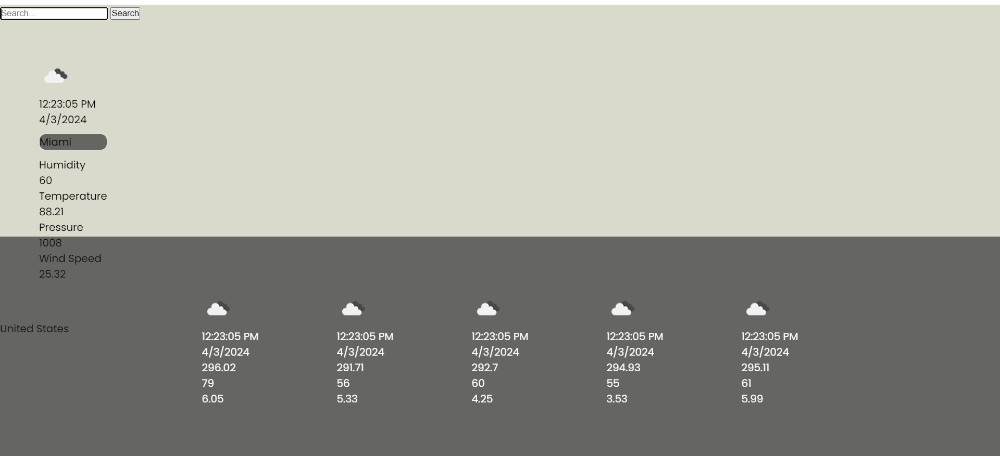

# My Weather Application

## Description

This project is to allow the user to view the weather, time and overall environment where they currently reside. They should be able to refresh the page view the conditions outside updated accordingly. There is also a search bar that is used to search up other cities' conditions.

## Table of Contents
- [Installation](#installation)
- [Usage](#usage)
- [Credits](#credits)

## Installation

This project was completed from scratch using HTML, CSS, and JavaScript. 

## Usage

By starting with a basic skeleton, you then add the Open Weather Map API for the function of the weather app.

## Credits

Code that was referenced by Asish George Tech on YouTube. He was a helpful guide with the project and the video reference is linked below.

https://www.youtube.com/watch?v=6trGQWzg2AI

The API used was Open Weather Map. A link to that page is listed below.

https://openweathermap.org/api

Old projects I have completed helped a lot with this project as well.

